# (Lin, Tegmark, and Rolnick 2017) {#section}

(Lin, Tegmark, and Rolnick 2017) (Lin, Tegmark, and Rolnick 2017)

while
th

where

This is important because in physics the Hamiltonians often take simple
forms. In their words:

"neural networks only work well for an exponentially tiny fraction of
all possible inputs, the laws of physics are such that the data sets we
care about for machine learning (natural images, sounds, drawings, text,
etc.) are also drawn from an exponentially tiny fraction of all
imaginable data sets"

For example Hamiltonians that are **polynomials of low order** and obey
other constrains such as **locality**(sparse) and **symmetry** play a
special role in physics and machine-learning. They show that finite
shallow neural networks can approximately polynomials arbitrarily well.

The conjecture is that if the physical world is described by low order
polynomial Hamiltonians and deep learning approximates well polynomials
then this is why it works well for data that come from the physical
world.

# Raissi, Perdikaris, and Karniadakis (2019) {#section-1}

They use neural networks for approximating continuous and discrete-time
PDEs. I am mainly interested in the discrete-time case.

The idea is to incorporate as much physical knowledge as possible in the
NN. For example, the boundary conditions become terms in the loss
function. Also,the structure of the PDE is encoded using a neural
network and auto-grad. They approximate the dependent variable with a NN
and use auto-grad to get its derivatives. Using these buidling blocks
they construct the whole PDE. They only using training data from a point
fixed in time. Learning is possible because the loss function and the
embedded structure is constraining the solution space.

# Lample et al. (2017) {#section-2}

They train a encoder-decoder network so that the latent space is unaware
of specific image attributes. Along with the with the decoder there is a
discriminator. The discriminator takes as input the latent space and is
condition on the values of the attributes. During training the network
they adversarially train the discriminator so that it can't tell the
real attributes from fake. The attributes for training are binary but
during generation real values can be used to provide a spectrum i.e.
from young to old. This application offers a forced and explicit
disentanglement, although full disentanglement is not empirically
observed by the authors.

{width="90%"}

# Rezende and Mohamed (2015) {#section-3}

[IPAM Lecture
Video](http://www.ipam.ucla.edu/abstract/?tid=16242&pcode=MLPWS1
) by Laurent Dinh from Google/MILA.

The main idea comes from the transformation of variables
 for probability distributions.

They propose that by using a series of bijective tranformations 
one can get from a simple starting distribution i.e. gaussian to a
complicated one that explains the data.

The transformations must be invertible (bijective) for the sampling to
work. To make the calculation of the determinant tractable they enforce
triangular Jacobians.

# Chen et al. (2018) {#section-4}

Ruthoto: the selling point of Neural ODEs is that you don't need to
store anything in memory because during the backward pass you can
integrate backwards in time. But in his lecture he showed that the
backward integration does introduce errors (Ruthotto and Haber 2019).

# Yıldız, Heinonen, and Lähdesmäki (2019) {#section-5}

Its an extension of VAE. The VAE encodes and decodes the latent space.
The Neural ODEs are used to \"propagate\" this latent space
continuously. They also use a bayesian networks as prior in the VAE so
they can model uncertainty. The Neural ODE part gives continuous instead
of discrete dynamics, the bayesian network can model multiple
trajectories (uncertainty).

# IPAM - Deep Learning in the Physical Sciences, Kyle Cranmer

[Lecture
Video](http://www.ipam.ucla.edu/abstract/?tid=14649&pcode=DLT2018) by
Kyle Cranmer, NYU

Many areas of science have simulations based on some well- motivated
mechanistic model. However, the aggregate effect of many interactions
between these low-level components leads to an intractable inverse
problem. The developments in machine learning and AI have the potential
to effectively bridge the microscopic - macroscopic divide and aid in
the inverse problem.

-   they can provide effective statistical models that describe
    macroscopic phenomena that are tied back to the low-level
    microscopic (reductionist) model

-   generative models and likelihood-free inference are two particularly
    exciting areas

::: {.center}
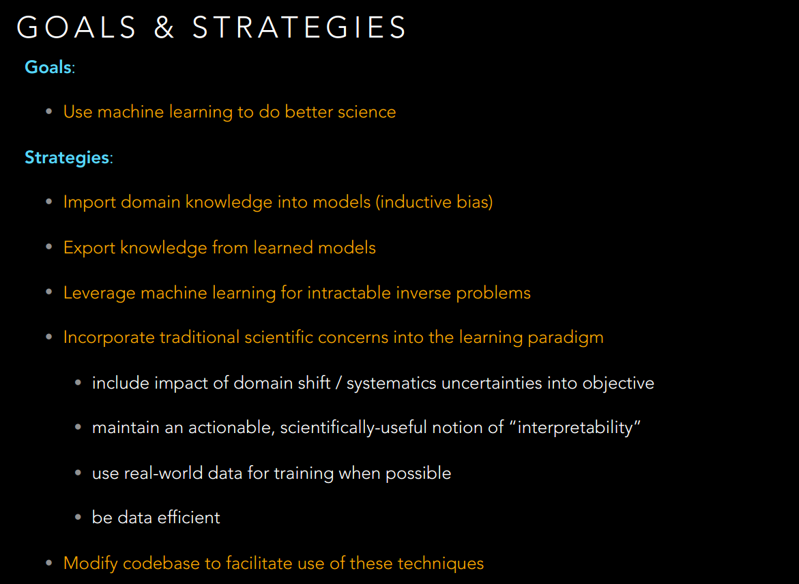{width="80%"}
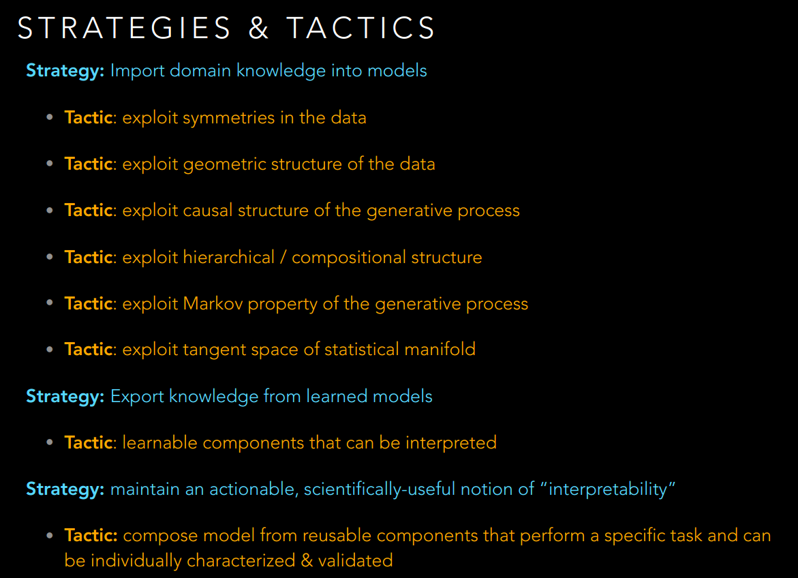{width="80%"}
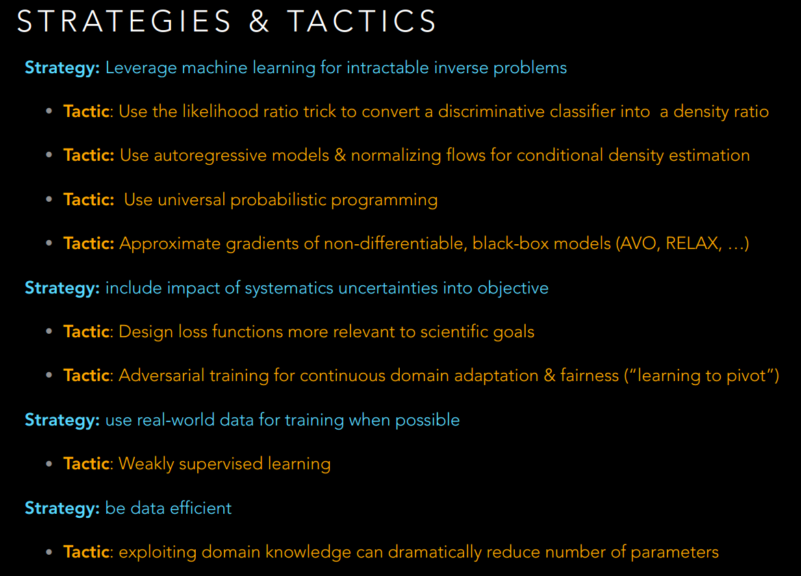{width="80%"}
:::

# IPAM - Physics-Informed (and -informative) Generative Modelling in Astronomy, Joshua Bloom

[Lecture
Video](http://www.ipam.ucla.edu/abstract/?tid=16152&pcode=MLPWS1) by
Joshua Bloom from UC Berkeley.

How and why physics can be imbued in neural network models.

-   Symmetry. For example translational and rotational in-variance in
    convolutions.

-   Bottlenecks enforce sparsity and Occam's razor.

-   Loss function is physically meaningful per sample (i.e.
    reconstruction) but also for the whole generative model (i.e.
    distributional loss).

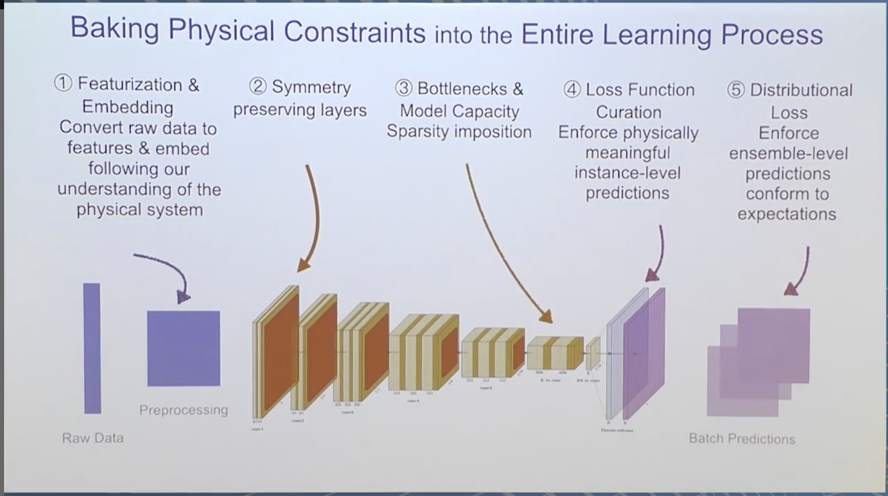{width="90%"}

# IPAM - Deep Generative Learning for Physics Many-Body Systems, Frank Noe

[Lecture
Video](http://www.ipam.ucla.edu/programs/workshops/workshop-i-from-passive-to-active-generative-and-reinforcement-learning-with-physics/?tab=schedule)
by Frank Noe, Freie University of Berlin

An application of normalizing flows (Rezende and Mohamed 2015) and Real
NVP (Dinh, Sohl-Dickstein, and Bengio 2016) in statistical physics.

# IPAM - Deep Generative Networks as Inverse Generators, Stephane Mallat

[Lecture
Video](http://www.ipam.ucla.edu/abstract/?tid=14547&pcode=DLT2018) by
Stephane Mallat, Ecole Normale Superieure

**TL;DR** You can use priors to avoid learning a discriminator (GANs) or
an encoder (VAEs) of generative network.

-   Learning works well but you can formulate the problem as an inverse
    problem. This makes the problem tractable and allows for to
    incorporate all the prior information you know which is important
    for example in physics. Making the problem tractable means you can
    learn with less data.

-   Generators work like distributed (sparse) memories, they learn the
    pattern. The embedding has no information about the original
    patterns, it's a completely fixed operation. All the information is
    in the generator. What is the memory capacity of these networks?

# IPAM - Breaking Bad: Recent Advances from Function Space Characterization of Neural Nets with Implications for Physical Applications, Ankit Patel

[Link to
video](http://www.ipam.ucla.edu/abstract/?tid=15765&pcode=MLPWS1)

Parametrization: After training you can reduce the parameters of a
network by 95% without loss of accuracy. Overparametrization is needed
for learning but not for expressivity.

Lottery ticket hypothesis: The initial weights in some part of the
network lead to good learning. Bigger networks have more chances.
Alignment with overparametrization.

Loss surface: High non-convexity but many local minima close to global
minimum.

Generalization: Implicit regularization. For example adam vs sgd produce
different generalization. Happens when the loss function is
underdetermined.

# IPAM - A Numerical Analysis Perspective on Deep Neural Networks, Lars Ruthotto

[Link to
video](http://www.ipam.ucla.edu/abstract/?tid=16362&pcode=MLPWS1)

ANODE paper Gholami et al 2019 exposes the challenges with Neural ODEs
(Chen et al. 2018). Hamiltonian NN (Ruthotto and Haber 2019): You can
get from input space to latent space and back,
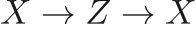, without loss. Related to Reversible Net.

Two ways to do optimal control.

-   **First differentiate and then discretize.** First you solve the ODE
    forward in time and then based on the trajectory you solve another
    ODE backward in time. This other ODE is the adjoint equation and the
    process is similar to backprop. The adjoint is linearized so it is
    easier to solve. But the gradients you get from the adjoint are only
    useful if you solve forward and adjoint equations well. Because we
    work on a discretized domain.

-   **First discretize and then differentiate.** The PDE is discrete. We
    can use auto-grad to take the gradient out. The backprop gradients
    are often the same as what discretization of the adjoint equation
    would give, but not necessarily the ones for the \"optimal\" adjoint
    equation. The gradients are useful even if discretization is
    inaccurate. For example in the case of data with noise we don't need
    to solve the PDE with high accuracy because it is pointless.

**Why numeric methods for deep learning?**

-   Transfer learning

    -   DL is similar to path planning, optimal control, differential
        equations.

-   Do more with less

    -   Better data efficiency

    -   3D image and video classification?

-   Power of abstraction.

    -   Use contintuous interpretation to design and relate
        architectures.

# IPAM - Recent advances in Derivative-Free Optimization and its connection to reinforcement learning, Katya Scheinberg

[Link to
video](http://www.ipam.ucla.edu/abstract/?tid=15766&pcode=MLPWS1)

-   Derivative based optimization: we know the height and the slope. As
    if we are on a mountain.

-   Black-box optimization: we only know the value of our function. As
    if we are in the surface of the lake and measure the depth. The
    measurements are noisy.

Applications of derivative-free optimization:

-   Machine learning: binary loss function (1-0 loss). It is not
    black-box but the derivative is useless.

-   Deep learning: hyperparameter tuning

-   Reinforcement learning: policy gradients are gray-box, MCTS

Types of derivative-free methods:

\- Direct and random search

\- Model based (interpolate sample points with linear or quadratic
function)

For model-based we can use NNs. One assumption for convergence, the
model should have comparable Taylor expansion as the true function
w.r.t. to the step size. Quadratic models are better but cost should be
taken into account.

-   Interpolation allows previous points to be reused (sample
    efficiency)

-   Linear algebra can be expensive and ill-conditioned in high dims
    (RL)

-   Pre-designed sampling is is an option but incurs costs

-   Alternatives like Gaussian smoothing not necessarily better than
    pre-designed sampling

# M. Cranmer et al. (2019) {#section-6}

[NeurIPS ML4S
video](https://slideslive.com/38922576/learning-symbolic-physics-with-graph-networks)

They look the problem of multi-body systems. The model they use is a
graph network. They try to extract Netwon's laws from the network. The
idea is as follows: in netwonian mechanics each body \"feels\" the force
from each one of the other bodies. In graph networks each body can be a
node and the force can be the vector message passed from one node the
the other. If the dimension of the message vectors of the graph network
is the same as the dimension of the force then after training they will
be equal. Actually they find that the messages learn a linear
transformation of Newton's laws.

To cope with unknown forces they use symbolic regression. Symbolic
regression is a technique to find the proper formula to fit your data
compining operations from a pool of operations like addition,
multiplication, power etc. So, they approximate the force with symbolic
regression on the messages. How do they find the correct dimension for
the messages? They start with a higher dimension and reduce it until the
error goes up (like the elbow method).

They also found that lower dimensional messages generalize better to
different number of bodies.

# K. Cranmer, Brehmer, and Louppe (2019) {#section-7}

[Link to video](https://www.youtube.com/watch?v=odAQlcf5Urc)

Usually in Bayesian inference you want to calculate the posterior:

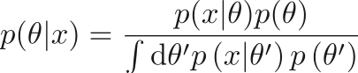

There are two sources of intractability for bayesian inference. The
first is when the evidence  is intractable. This is solved by MCMC
and VI. The other, common in simulations, is the intractability of the
likelihood . This is also known as likelihood-free
inference. Two ways to solve is 1) Approximate Bayesian Computation
(ABC) and 2) create a model of the likelihood with methods like
histograms or kernel density estimation. ABC uses summary statistics to
reject or accept samples from the likelihood.

**Shortcomings of likelihood-free (simulation based) inference:**

-   Sample efficiency. Curse of dimensionality means ABC does not scale
    well

-   Quality of inference. Using summary statistics leaves some
    statistical power on the table.

-   Amortization. KDE is amortized but ABC not. In ABC new data requires
    repeating most steps.

**Three ways to improve from recent advances in neural networks:**

-   Neural networks do not suffer from the curse of dimensionality. In
    inference they can be used as surrogate models.

-   Active learning can improve sample efficiency

-   Integration of auto-diff and probabilistic programming in the
    simulation code. Simulators are no longer black boxes.

Talks a lot about normalizing flows and similar models.

**REVISE AGAIN LATER**

# Both et al. (2019) {#section-8}

[Link to video](https://www.youtube.com/watch?v=Ml4EXS_MUBc)

Their idea is to use a combination of neural networks and symbolic
regression to do ODE identification in the presence of noise. The way
they do is by incorporating the symbolic regression \*within\* the
neural network.

The model works as follows. First a neural network predict . Then
with auto-diff they get . Then they have a lexicon of all possible
symbolic variables  and weight it with . The loss function
is the reconstruction MSE plus the error between the  and
 plus a regularization in . This way the network
does not only learn to reconstruct but also to discover the network. The
L1 regularization promotes sparsity in the coefficients.

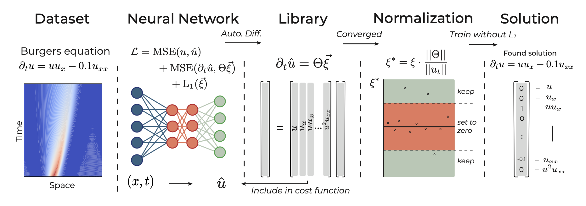{width="90%"}

They also have another paper named Temporal Normalizing Flows that does
the system identification in PDEs (Both and Kusters 2019).

# Rezende et al. (2019) {#section-9}

[Link to video 1](http://youtube.com/watch?v=8VV0kL7Qg3Y)

[Link to video
2](https://slideslive.com/38922578/equivariant-hamiltonian-flows)

This paper tries to conserve invariance when normalizing flows are used
to transform distributions. Suppose a base distribution  is
invariant with respect to a group of transformations. If we transform
this density via a generic normalizing flow , there will be no
guarantees that the transformed density 
will be invariant as well. To do that they introduce equivariant
Hamiltonian normalizing flows. The Hamiltonian is a function
. They use two NNs one for
the potential and another for the kinetic. They seperate the NNs because
they use a symplectic integrator.

Assume the data have a knowν symmetry generator. In order to apply a
Hamiltonian flow on it they want to preserve the symmetry. To do that
they use a regularizer between the flow and the symmetry generator. The
regularizer is the Poisson bracket which for two scalar functions 
is:

The Hamiltonian coordinates and momentum in this method is not
observable in the data. What one can do is treat the momentum variables
p as latent. These variables has to be marginalized, as in Hamiltonian
MC. To do that they use a variational approximation and optimize for
VLB.

# Sanchez-Gonzalez et al. (2019) {#section-10}

[Link to
video](http://www.ipam.ucla.edu/abstract/?tid=16226&pcode=MLPWS2)

-   Simulator: predicts next step from current by applying physics.

-   DeltaGN: it predicts the deltas for momentum and position. It's like
    an Euler scheme.

-   OGN: use a graph network to predict the derivatives and feed it to
    an integrator to predict.

-   HOGN: use a GN to predict the Hamiltonian energy H. Then
    differentiate that with auto-diff wrt to the input and treat is as a
    Hamiltonian. Then feed it to a symplectic integrator.

OGN and HOGN generalize better to time steps they have not been trained
upon. They did two experiments one with fixed timestep and another where
the timestep came from a range and they were feeding this timestep value
with the input.

{width="90%"}

# Sanchez-Gonzalez et al. (2018) {#section-11}

Interesting things about poking the system to infer latent variables
with physical meaning like mass etc. These can be later used for
downstream tasks. The system can be learned end-to-end.

The question is what actions lead to optimally identify the latent
variables?

Another interesting thing is the pre-trained model can be used for model
predictive control. MPC is when you have a model and then optimize for
the controls that will give you a desired trajectory. There is no
policy, the learned model serves as a forward model for simulation. The
cool thing with GN is that it can be applied to multiples systems
because it does pairwise predictions. This can be scaled to arbitrarily
many pairs.

Also interesting things with predicting a multi-agent environment.
Taccheti et al 2019.

# "Etalumis: Bringing Probabilistic Programming to Scientific Simulators at Scale." Gunes Baydin et al. 2019

[Link to video](https://www.youtube.com/watch?v=aCh_n2yzSRc) [Link to
video](http://www.ipam.ucla.edu/abstract/?tid=16191)

They combine simulators with probabilistic programming for inverse
problems.

# Shanahan et al. (2019) {#section-12}

The use attention to extract \"points of interest\" from an image and
then learn the relations of those points. The architecture is similar to
Multi Head Attention (Vaswani et al. 2017) and close to a previous paper
in Deep RL. They find that training on a relational task and then freeze
the network helps with learning a new task (they only train the last
part of the net). The attention learns to focus on the objects mostly.
Also the representation they learn captures meaningful properties of the
objects (after PCA), ie distinguishes between color & shape. Lastly
their network can output symbolic propositions, prolog style, and these
propositions can be queried from symbolic programming (prolog), although
what these propositions mean is unclear.

This work is related to graph networks but there we have the objects
identified from a previous task, or they are given. This method
identifies its own \"objects\" with attention. Also the work is relevant
to symbolic/relational reasoning and AI.

Related review paper is (Garnelo and Shanahan 2019): *\"In sum, there is
a spectrum of approaches to compositionality, ranging from methods that
engineer compositional structure directly into the representations to
meth- ods that allow compositionality to emerge from the learning
process in response to compositional structure in the data. Mid-way
along this spectrum we find recent work on autoencoders whose loss
functions promote com- positional representation.\"*

# Brunton et al. (2016) {#section-13}

[IPAM WS2
video](http://www.ipam.ucla.edu/abstract/?tid=15783&pcode=MLPWS2)

They do system identification in ODEs and PDEs from noisy data. They do
sparse regularization to come up with only a few terms in each case. In
the video he explains that you first can do a transformation that will
linearize your system. This is the theory behind Koopman Operators but
they are hard to find. By using NN they can jointly linearize the system
and find its equations at the same time.

# Adjoints and their applications, P. Farrell

[Link](dolfin-adjoint.org/en/latest/documentation/maths/index.html)

Let's say you want to design a wing with a low lift-to-drag ratio 
given some configuration of the wing parameterized by . The physics
of the systems are described by a systems of PDEs 
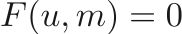
. By
solving this equation we get a solution . For each set of
parameters  we get a solution, so  is implicitly a function of
parameters . The set of PDEs pose a constraint on the optimization
problem over . So one way to go about this is to treat the PDE solver
as a black box and solve for a functional *functional*

. The problem is that since the solver is a
black box to use, we only have the values of  without its
derivative. Thus we can only use derivative-free optimization such as
genetic algorithms. Derivative-free optimization methods do not scale
well with dimensions and can take a lot of iterations to converge. If we
have derivative info for  we can converge one or two orders
of magnitude faster. There are three main ways to compute derivatives:
Finite differences, tangent linear approach and the adjoint method.

## Finite differences 

These are straightforward:

## Tangent linear approach

Applying chain rule to the functional  gives:

The hard part here is the Jacobian matrix  with dimensions
 (solution space x parameter space). We can find a solution
implicitly by differentiating  wrt .

The last equation is called the **tangent linear equation**. The unknown
is . The term  is a matrix
 so it's actually a linear operator around the solution ,
no matter if  is linear or not. Similarly
 is a matrix . This term acts
as a source term, each column of 
provides the source term for the derivative over . Notice that the
functional  does not appear at all. For a given parameter (input),
the tangent linear solution can be used to easily compute the gradient
of any functional. This means that solving the tangent linear system
makes sense when there are a small number of parameters (inputs), and a
large number of functionals of interest (outputs).

## Adjoint method

Suppose the tangent linear system is invertible. Then we can rewrite the
solution Jacobian as:

So the derivative of the loss over the parameters becomes:

The adjoint is:

# IPAM - Improving PDE solvers and PDE-constrained optimization with deep learning and differentiable programming

[Link to
video](http://www.ipam.ucla.edu/abstract/?tid=16344&pcode=MLPWS2)

Combine approximation of neural networks with the domain knowledge of
physical laws. Adding the physical laws can help with interpretability
and generalization. By differential programming he means machine
learning (auto-grad). They present two methods:

## Bar-Sinai et al. (2019) {#section-14}

This paper uses ML to find what discretization to use for solving PDEs.
e.g. what coefficients to use in central approximation of derivatives:

## Hoyer et al. Neural reparametrerization improves structural optimization.

Deep Image Prior (**Lempitsky2018DeepPrior?**): train a CNN to
reconstruct just one image and this produce a super-resolution image.
The idea is that the only optimize one example and for a limited amount
of iterations. This for some reason works well for reconstructing the
details. They use a similar approach.

# (**Lempitsky2018DeepPrior?**) {#section-15}

[Medium
article](https://medium.com/@ahmdtaha/deep-image-prior-7e0eac506dee)

[Another medium
article](https://towardsdatascience.com/demystifying-deep-image-prior-7076e777e5ba)

This work is about image restoration, denoising, inpainting etc. We
denote the clean image as , the degraded image as  and the
restored image as . We try to find:

where:

hence:

In this case 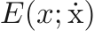 is some reconstruction cost and
the  is the image prior which works as a regularizer. Usually what
you do is start from a random image and try to traverse the image space
until you reach a good point. The reconstruction cost is task specific
while the regularizer is some implicit or explicit prior about the
distribution of images. Also the reconstruction can be learned
end-to-end with a neural network from real images. This paper uses
another method, instead of finding the reconstructed image it tries to
find a neural network that starts with noise and creates a reconstructed
image. They motivate this by saying that the NN is a surjective mapping
from the parameters of the network  to the image space
. They only take into account E and get rid of
the regularizer. The method is feeding noise to a U-Net and make it
reconstruct the corrupted image. If you train it for a long time it will
reconstruct the noisy image but if you stop early then the image you get
is pretty close to the original one. It is not clear when to stop, other
methods tried to find heuristics on that (check link 1 above). This
paper indicates that the structure of the CNN is a good prior for images
by itself.

# Bengio et al. (2019) {#section-16}

The authors define \"a meta-learning objective that measures the speed
of adaptation, i.e., a form of regret, in order to optimize the way in
which knowledge should be represented, factorized and structured \...
this way, we can take what is normally considered a nuisance in machine
learning (changes in distribution due to non-stationarity, uncontrolled
interventions, etc.) and turn that into a training signal to find a good
way to factorize knowledge into components and mechanisms that match the
assumption of small change. \"

Imagine we have a system that produces data. A change in the system
(interventioin) causes a non-stationarity in the produced data and their
distribution changes. This is a common setup in supervised learning
where the testing data are different from the training data. Let say
that the system has two parts, one that changes after the intervention
and another part that stays the same. If our model can capture this it
would be easier to adapt.

This can be depicted in a graphical model with two nodes A,B. In this
case the joint distribution is , both
factorizations are valid. Imagine that we change the distribution 
through an intervention. This imposes implicitly a specific causal
structure to the model where  (A is the parent of B)
and only one of the factorizations is actually true. So if a neural
network learns the original distribution  after the change in
 it needs to re-learn the new distribution. The authors say that
if the NN learns the correct causal structure  then
after an intervention in  it should be able to meta-learn faster
than the model with the opposite structure. Experimentally, they
demonstrate that indeed the correct model learns faster in a
meta-learning setting. They also construct a formulation of regret, i.e.
how fast a network meta-learns. They show that this indicates the
correct model, opening the avenue to learn a causal model from the data
directly, in this simple scenario.

# Vaswani et al. (2017) {#section-17}

[Link to article](http://www.peterbloem.nl/blog/transformers)

This is best understood in a language modeling setting. We have a
sequence of words. Each word has an embedding (we learn it), also each
word can have a positional embedding, also learned. Then there is the
attention module which has three matrices Q, K, V:

Where k is the dimension of the embedding. We can also have multi head
attention where each head applies to the input sequence seperately.
There many variations on how to learn the various heads, in the original
paper they learn linear transformations of Q,K,V for each head but we
can also learn separate matrices for each head.

The  does the final aggregation of the heads, see figure below.

{width="80%"}

Below we see a typical transformer networks. This is the sequence: a
self attention layer, layer normalization, a feed forward layer (a
single MLP applied independently to each vector), and another layer
normalization. Residual connections are added around both, before the
normalization. The order of the various components is not set in stone;
the important thing is to combine self-attention with a local feed
forward, and to add normalization and residual connections. (from
article link)

Basic intuitions:

-   The word embedding that are more relevant will give a higher score.

-   The context is important that's why we sum all over it.

-   In RNNs we have to do serial computation but in Transformer this is
    not a problem we can run a whole sentence in parallel.

-   In constrast with convolutions we have all the context at hand, we
    don't need repeated layers that use stride/downsampling that dilutes
    the signal

# Schölkopf (2019) {#section-18}

He makes the point between statistical and causal dependence, which is
the analogous of correlation is not causation. Argues that causality is
needed for generalization. When the IID assumption is violated (dataset
shift) then statistical methods fails. A causal model contains more info
that a statistical one because it contains the dependencies between the
variables.

The **Common Cause Principle** says that if two vars are dependent then
there is another one that causally influences both. The main modelling
tool for causal graphs are the **Structural Causal Models (SCM)**. The
idea is that instead of have parent-child relationships  we
model the variables as functions , where U is a
stochastic unexplained variable (noise). The set of noises
 are jointly independent. The SCM allows for
interventions in U or f (ie set it constant). We can write the causal
factorization:

Statistical learning tries to find a joint of the data, causal learning
seeks to exploit the fact that the joint distribution possesses a causal
factorization.

Taxonomy of models depending on the detail.

{width="90%"}

**Independent Causal Mechanisms (ICM) Principle.** The causal generative
process of a system's variables is composed of autonomous modules that
do not inform or influence each other. In the probabilistic case, this
means that the conditional distribution of each variable given its
causes (i.e., its mechanism) does not inform or influence the other
mechanisms. Our brains think that an object is independent of the
mechanism that gives us the information about said object. This is
called invariance.

**Causality in representation learning.** In SCM the noise is exogenous,
similar to how the noise is treated in VAEs, both use the
reparametrization trick. Various directions. *Learning transferable
mechanisms:* the world is modular we can learn independent causal
mechanisms. This can be done with competitive training (Goyal et al.
2019). *Learning disentangled representations:* Intervening upon latent
variables. One way to intervene is to replace noise variables with the
corresponding values computed from other input images, a procedure that
has been referred to as hybridization by Besserve et al. (2018b).
*Learning interventional world models and reasoning* Causality will play
a role in representation learning and maybe self-consiousness might need
to be represented in the latent variables.

# Goyal et al. (2019) {#section-19}

Their idea is that a complex generative model, temporal or not, can be
thought of as the composition of independent mechanisms or "causal"
modules. They use multiple LSTMs each one with each own attention
mechanism which they call Recurrent Independent Mechanisms. Since the
queries depend on the state of the RIMs, this enables individual RIMs to
attend only to the part of the input that is relevant for that
particular RIM, thus enabling selective attention based on a top-down
attention process. They promote the competition between RIMs for the
final output by keeping the \"highest rated\" RIMs for each input. They
also allow communication between RIMs by allowing the activated RIMs to
read from all other RIMs (activated or not). The intuition behind this
is that non-activated RIMs are not related to the current input, so
their value should not change. However they may still store contextual
information that is relevant for activated RIMs.

# Van Steenkiste et al. (2019) {#section-20}

In previous work (Locatello et al. 2018) they had found that
disentanglement did not provide better results in downstream tasks. But
it was a very simple taks. In this work they look deeper and find that
disentanglement indeed helps with downstream tasks. They are considering
relations reasoning tasks like dSprites and 3dshapes. This paper is a
huge study of 360 unsupervised models from 4 different disentanglement
approaches (beta-VAE, FactorVAE, beta-TCVAE, and DIP-VAE). The
disentangled representations are then used to train Wild Relational
Networks. They report \"compelling evidence that more disentangled
representations yield better sample-efficiency in learning to solve the
considered abstract visual reasoning tasks\".

# Arjovsky et al. (2019) {#section-21}

Interesting experiment: split MNIST datasets in two, from 0-4 and 5-9.
The labels have 25% error so a perfect classifier can only be 75%
correct. Then we color both classes in different color (low numbers
green, high numbers red). The color labels have also noise 0.1 or 0.2
(two \"environments\"). A normal classifier would take advantage of the
color because the noise is less than the noise due to shape. But it
would fail if during test the color noise is 0.9. A classifier that
learns the invariant causes of the data i.e. the shapes would be more
robust. Invariance across environements buys extrapolation powers. But
this is not straightforward how to do it in realizable problems (that is
when the noise in labels is small and the classifier can get close to
optimal performance).

The statistical problem is a proxy of the real problem, there is a gap
we haven't explored. Nature does not shuffle, by shuffling we remove
useful information, mainly the info that is stable and invariant. When
you are optimal for multiple environments and linear combinations of
them then possibly you can extrapolate. Invariance is closely related to
causation. Whithout noise it's trickier.

Difference to domain adaptation. In DA you know the target domain and
you also don't care about the output labels. DA is for covariate shift,
ie diss of X and Y change together, in IRM distribution over X stays the
same but changes for Y.

# Lu et al. (2019) {#section-22}

Transformer as ODE Conv-Diff solver.

# Mooij, Janzing, and Schölkopf (2013) {#section-23}

The formulate structural equations where the derivatives of a variable
depend on its parent variables in a structural causal model (SCM). This
model also has corresponding equilibrium equations. They say that an SCM
can model an ODE. But SCM there are no loops while in ODEs a derivative
of a variable can depend on the value of the same variable. They say
that the solution is implicit by the structural stability solutions:

# M. Cranmer et al. (2020) {#section-24}

They look into physical systems that can be modeled as interacting
nodes. They use graph networks to learn to predict those systems and
regularize the message passing between the nodes. In systems like moving
particles they show that the most important messages element 
(after regularization) corresponds to (a linear combination) of the real
forces.

They also use symbolic regression to predict  from mass,
positions of nodes, etc and are able to recover (not always) the
underlying physical laws.

# Saemundsson et al. (2019) {#section-25}

The take the idea of Neural ODEs where neural networks are seen as
discretized dynamical systems. They mix that with the viewpoint of
geometric embeddings which impose structure on an embedding space.
Instead of the Euler scheme and make use variational integrators, a
class of discretization methods that respect and preserve the underlying
geometry of a physical system.

# Greydanus, Dzamba, and Yosinski (2019) {#section-26}

They parametrize the Hamiltonian H of a system with a neural net. They
use autograd and Hamilton's equations to predict the derivatives of the
phase space:

Then they use an Euler integrator to find the next point in the phase
space.

# Toth et al. (2019) {#section-27}

They use a network to deduct a latent space from pixel observations
(multiple frames). They unroll this latent space to the future using the
Hamiltonian equations. The latent space is not 2-dimensional (like the
phase space) but higher. The motivation is that respecting the
Hamiltonian in the latent space will preserve energy. They use a
leapfrog (symplectic and energy preserving) integrator.

# Higgins et al. (2018) {#section-28}

Still absorbing.

They formulate the disentanglement of factors of variation in the
generative process that creates the data. The formulation is based on
group theory and the decomposition of group actions in subgroups.
Interestingly the rotation around the cartesian axes can not be
decomposed in subgroup actions.

\"In machine perception, the most powerful generalisation we can hope
for is by understanding what properties of the world remain the same
when transformed in certain ways.\"

# Locatello et al. (2019) {#section-29}

They study how some labels on the factors of variation can help with
model selection and semi-supervised learning. In the case of SS learning
they use the labels to learn the factors of variation in the latent
space. They normalize them in \[0,1\] and also do some binning (need to
read more on how to treat continuous factors).

Some good pointers for other types of inductive biases for
disentanglement such as:

> Other forms of inductive biases such as relying on temporal
> information (video data) (Denton and Birodkar, 2017; Yingzhen & Mandt,
> 2018), allowing for interaction with the environment (Thomas et al.,
> 2017), or incorporating grouping information (Kulkarni et al., 2015;
> Bouchacourt et al., 2018) were discussed in the literature as
> candidates to circumvent the impossibility result by Locatello et al.
> (2019b)

# Locatello et al. (2018) {#section-30}

They say that disentanglement cannot be achieved without inductive
biases in the model or the data (labels). They provide some concise
description of disentanglement metrics in the appendix.

# Miladinović et al. (2019) {#section-31}

They want to solve the problem of different dynamics in ODEs and in
general (similar to ours).

The formulation for the model is a bayesian DGM as a state-space model.
Where the dynamics D are inferred prior to the sequence prediction (and
affect all steps of the prediction). The idea in SSMs is that the next
prediction is found by unrolling the state-space and decoding it. The
also model noise in the latent space unrolling and the
reconstruction/decoding.

{width="80%"}

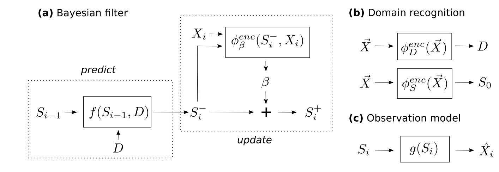{width="80%"}

# Le Guen and Thome (2020) {#section-32}

They disentangle the dynamics (movement) from the details (texture,
appearance). The PhyCell models the physics and the ConvLSTM the
details. PhyCell has a predictor and correction scheme (similar to DSSM
that models noise). The predictor is based on convolutions that combine
spatial derivatives.

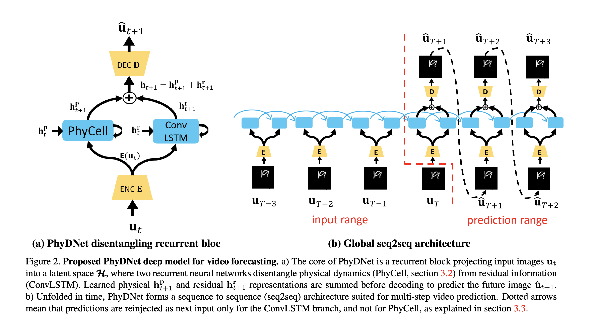{width="80%"}

# Linial, Eytan, and Shalit (2020) {#section-33}

Similar formulation like DSSM (Miladinović et al. 2019). They use an ODE
solver to propagate the state-space. Since this needs to be
differentiable they use the RK4 from NeuralODE (Chen et al. 2018). They
also use \"grounding\" i.e. they use ground truth state-space to inform
the latent space but only with low number of \"labels\" like 1 or 5 pc.
Similar to what I want to do with length but they do it with the state
space.

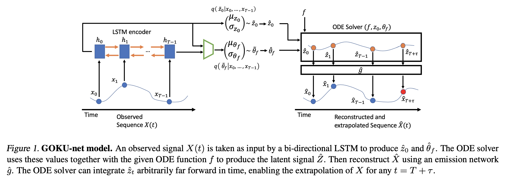{width="80%"}

# Sun et al. (2019) {#section-34}

The idea is to use an auxiliary \*unsupervised\* loss to fine tune the
model both during training and testing. For image classification such
loss could be something as trivial as predicting rotation. The loss is
not exactly \*unsupervised\* in the sense that we do have labels for it,
but these are very cheap to generate. In physical systems that could be
coming from domain knowledge e.g. energy conservation.

The network has two components. The first one is a shared component, we
can think of it as a feature extrator. On top of this extractor there
are two heads, one for the supervised and another for the unsupervised
tasks. In previous work, the unsupervised loss was used in training only
(Hendrycks and Dietterich 2019) and has showed that it increases the
robustness in the main task, but this work also uses it to update the
weights at training time before making a prediction. This work also
makes another assumption that in test time the samples come from the
same distribution. So in this case the keep the updates on the weights
for each test sample (they call this online).

This paper has a very good literature review for

-   **Learning on test instances.** "Shocher et al. (2018) pro- vide a
    key inspiration for our work by showing that image super-resolution
    could be learned at test time simply by trying to upsample a
    downsampled version of the input image. More recently Bau et
    al. (2019) improve photo manipula- tion by adapting a pre-trained
    GAN to the statistics of the input image."

-   **Self-supervised learning** studies how to create labels from the
    data, by designing various pretext tasks that can learn semantic
    information without human annotations. E.g. predicting rotation,
    context, colorization etc.

-   **Non-adversarial robustness** studies the effect of corruptions,
    perturbations, out-of-distribution examples, and real- world
    distribution shifts (Hendrycks and Dietterich 2019).

-   **Unsupervised domain adaptation (transfer learning)** studies the
    problem of distribution shifts, when an unlabeled dataset from the
    test distribution (target domain) is available at training time, in
    addition to a labeled dataset from the training distribution (source
    domain). The limitation of the problem setting, however, is that
    generalization might only be improved for this specific test
    distribution, which can be difficult to anticipate in advance.

-   **Domain generalization** studies the setting where a meta
    distribution generates multiple environment distributions, some of
    which are available during training (source), while others are used
    for testing (target). With only a few environments, information on
    the meta distribution is often too scarce to be helpful, and with
    many environments, we are back to the i.i.d. setting where each
    environment can be seen as a sample, and a strong baseline is to
    simply train on all the environments.

-   **One (few)-shot learning** tudies how to learn a new task or a new
    classification category using only one (or a few) sample(s), on top
    of a general representation that has been learned on diverse
    samples.

-   **Continual learning** Continual learning (a.k.a. learning without
    forgetting) studies the setting where a model is made to learn a
    sequence of tasks, and not forget about the earlier ones while
    training for the later

-   **Online learning**. The basic setting repeats the following:
    receive xt, predict yˆt, receive yt from a worst-case oracle, and
    learn. Final performance is evaluated using the regret, which
    colloquially translates to how much worse the online learning
    algorithm performs in comparison to the best fixed model in
    hindsight.

# Alet et al. (2020) {#section-35}

The extend the idea of test-time training from (Sun et al. 2019), which
they call tailoring. Furthermore they use meta-learning in the sense
that during training they learn a model that will behave well on
test-time with tailoring.

::: {#refs .references .csl-bib-body .hanging-indent}
::: {#ref-Alet2020Tailoring:Time .csl-entry}
Alet, Ferran, Kenji Kawaguchi, Maria Bauza, Nurullah Giray Kuru, Tomas
Lozano-Perez, and Leslie Pack Kaelbling. 2020. "[Tailoring: encoding
inductive biases by optimizing unsupervised objectives at prediction
time]{.nocase}," September. <http://arxiv.org/abs/2009.10623>.
:::

::: {#ref-Arjovsky2019InvariantMinimization .csl-entry}
Arjovsky, Martin, Léon Bottou, Ishaan Gulrajani, and David Lopez-Paz.
2019. "Invariant Risk Minimization," July, 1--30.
<http://arxiv.org/abs/1907.02893>.
:::

::: {#ref-Bar-Sinai2019LearningEquations .csl-entry}
Bar-Sinai, Yohai, Stephan Hoyer, Jason Hickey, and Michael P. Brenner.
2019. "[Learning data-driven discretizations for partial differential
equations]{.nocase}." *Proceedings of the National Academy of Sciences
of the United States of America* 116 (31): 15344--49.
<https://doi.org/10.1073/pnas.1814058116>.
:::

::: {#ref-Bengio2019AMechanisms .csl-entry}
Bengio, Yoshua, Tristan Deleu, Nasim Rahaman, Rosemary Ke, Sébastien
Lachapelle, Olexa Bilaniuk, Anirudh Goyal, and Christopher Pal. 2019.
"[A Meta-Transfer Objective for Learning to Disentangle Causal
Mechanisms]{.nocase}," January. <http://arxiv.org/abs/1901.10912>.
:::

::: {#ref-Both2019DeepMoD:Data .csl-entry}
Both, Gert-Jan, Subham Choudhury, Pierre Sens, and Remy Kusters. 2019.
"[DeepMoD: Deep learning for Model Discovery in noisy data]{.nocase},"
April. <http://arxiv.org/abs/1904.09406>.
:::

::: {#ref-Both2019TemporalFlows .csl-entry}
Both, Gert-Jan, and Remy Kusters. 2019. "Temporal Normalizing Flows,"
December. <http://arxiv.org/abs/1912.09092>.
:::

::: {#ref-Brunton2016DiscoveringSystems .csl-entry}
Brunton, Steven L., Joshua L. Proctor, J. Nathan Kutz, and William
Bialek. 2016. "[Discovering governing equations from data by sparse
identification of nonlinear dynamical systems]{.nocase}." *Proceedings
of the National Academy of Sciences of the United States of America* 113
(15): 3932--37. <https://doi.org/10.1073/pnas.1517384113>.
:::

::: {#ref-Chen2018NeuralEquations .csl-entry}
Chen, Ricky T. Q., Yulia Rubanova, Jesse Bettencourt, and David
Duvenaud. 2018. "Neural Ordinary Differential Equations." *UNITEXT - La
Matematica Per Il 3 Piu 2* 109 (June): 31--60.
<http://arxiv.org/abs/1806.07366>.
:::

::: {#ref-Cranmer2019TheInference .csl-entry}
Cranmer, Kyle, Johann Brehmer, and Gilles Louppe. 2019. "[The frontier
of simulation-based inference]{.nocase}," November.
<http://arxiv.org/abs/1911.01429>.
:::

::: {#ref-Cranmer2020DiscoveringBiases .csl-entry}
Cranmer, Miles, Alvaro Sanchez-Gonzalez, Peter Battaglia, Rui Xu, Kyle
Cranmer, David Spergel, and Shirley Ho. 2020. "[Discovering Symbolic
Models from Deep Learning with Inductive Biases]{.nocase}," June.
<http://arxiv.org/abs/2006.11287>.
:::

::: {#ref-Cranmer2019LearningNetworks .csl-entry}
Cranmer, Miles, Rui Xu, Peter Battaglia, and Shirley Ho. 2019.
"[Learning Symbolic Physics with Graph Networks]{.nocase}," no. NeurIPS.
<http://arxiv.org/abs/1909.05862>.
:::

::: {#ref-Dinh2016DensityNVP .csl-entry}
Dinh, Laurent, Jascha Sohl-Dickstein, and Samy Bengio. 2016. "[Density
estimation using Real NVP]{.nocase}." *5th International Conference on
Learning Representations, ICLR 2017 - Conference Track Proceedings*,
May. <http://arxiv.org/abs/1605.08803>.
:::

::: {#ref-Garnelo2019ReconcilingRelations .csl-entry}
Garnelo, Marta, and Murray Shanahan. 2019. "[Reconciling deep learning
with symbolic artificial intelligence: representing objects and
relations]{.nocase}." Elsevier Ltd.
<https://doi.org/10.1016/j.cobeha.2018.12.010>.
:::

::: {#ref-Goyal2019RecurrentMechanisms .csl-entry}
Goyal, Anirudh, Alex Lamb, Jordan Hoffmann, Shagun Sodhani, Sergey
Levine, Yoshua Bengio, and Bernhard Schölkopf. 2019. "Recurrent
Independent Mechanisms," September. <http://arxiv.org/abs/1909.10893>.
:::

::: {#ref-Greydanus2019HamiltonianNetworks .csl-entry}
Greydanus, Sam, Misko Dzamba, and Jason Yosinski. 2019. "Hamiltonian
Neural Networks," 1--15. <http://arxiv.org/abs/1906.01563>.
:::

::: {#ref-Hendrycks2019BenchmarkingPerturbations .csl-entry}
Hendrycks, Dan, and Thomas Dietterich. 2019. "[Benchmarking Neural
Network Robustness to Common Corruptions and Perturbations]{.nocase}."
*arXiv*, March. <http://arxiv.org/abs/1903.12261>.
:::

::: {#ref-Higgins2018TowardsRepresentations .csl-entry}
Higgins, Irina, David Amos, David Pfau, Sebastien Racaniere, Loic
Matthey, Danilo Rezende, and Alexander Lerchner. 2018. "[Towards a
Definition of Disentangled Representations]{.nocase}," December.
<http://arxiv.org/abs/1812.02230>.
:::

::: {#ref-Lample2017FaderAttributes .csl-entry}
Lample, Guillaume, Neil Zeghidour, Nicolas Usunier, Antoine Bordes,
Ludovic Denoyer, and Marc'aurelio Ranzato. 2017. "[Fader networks:
Manipulating images by sliding attributes]{.nocase}." *Advances in
Neural Information Processing Systems* 2017-Decem (Nips): 5968--77.
:::

::: {#ref-LeGuen2020DisentanglingPrediction .csl-entry}
Le Guen, Vincent, and Nicolas Thome. 2020. "[Disentangling Physical
Dynamics from Unknown Factors for Unsupervised Video
Prediction]{.nocase}."
:::

::: {#ref-Lin2017WhyWell .csl-entry}
Lin, Henry W., Max Tegmark, and David Rolnick. 2017. "[Why Does Deep and
Cheap Learning Work So Well?]{.nocase}" *Journal of Statistical Physics*
168 (6): 1223--47. <https://doi.org/10.1007/s10955-017-1836-5>.
:::

::: {#ref-Linial2020GenerativeUnknowns .csl-entry}
Linial, Ori, Danny Eytan, and Uri Shalit. 2020. "[Generative ODE
Modeling with Known Unknowns]{.nocase}," March.
<http://arxiv.org/abs/2003.10775>.
:::

::: {#ref-Locatello2018ChallengingRepresentations .csl-entry}
Locatello, Francesco, Stefan Bauer, Mario Lucic, Gunnar Rätsch, Sylvain
Gelly, Bernhard Schölkopf, and Olivier Bachem. 2018. "[Challenging
Common Assumptions in the Unsupervised Learning of Disentangled
Representations]{.nocase}." *36th International Conference on Machine
Learning, ICML 2019* 2019-June (November): 7247--83.
<http://arxiv.org/abs/1811.12359>.
:::

::: {#ref-Locatello2019DisentanglingLabels .csl-entry}
Locatello, Francesco, Michael Tschannen, Stefan Bauer, Gunnar Rätsch,
Bernhard Schölkopf, and Olivier Bachem. 2019. "[Disentangling Factors of
Variation Using Few Labels]{.nocase}," May.
<http://arxiv.org/abs/1905.01258>.
:::

::: {#ref-Lu2019UnderstandingView .csl-entry}
Lu, Yiping, Zhuohan Li, Di He, Zhiqing Sun, Bin Dong, Tao Qin, Liwei
Wang, and Tie-Yan Liu. 2019. "[Understanding and Improving Transformer
From a Multi-Particle Dynamic System Point of View]{.nocase}," no.
NeurIPS: 1--10. <http://arxiv.org/abs/1906.02762>.
:::

::: {#ref-Miladinovic2019DisentangledRepresentations .csl-entry}
Miladinović, Đorđe, Muhammad Waleed Gondal, Bernhard Schölkopf, Joachim
M. Buhmann, and Stefan Bauer. 2019. "Disentangled State Space
Representations," June. <http://arxiv.org/abs/1906.03255>.
:::

::: {#ref-Mooij2013FromCase .csl-entry}
Mooij, Joris M., Dominik Janzing, and Bernhard Schölkopf. 2013. "[From
Ordinary Differential Equations to Structural Causal Models: the
deterministic case]{.nocase}." *Uncertainty in Artificial Intelligence -
Proceedings of the 29th Conference, UAI 2013*, April, 440--48.
<http://arxiv.org/abs/1304.7920>.
:::

::: {#ref-Raissi2019Physics-informedEquations .csl-entry}
Raissi, Maziar, P. Perdikaris, and G. E. Karniadakis. 2019.
"[Physics-informed neural networks: A deep learning framework for
solving forward and inverse problems involving nonlinear partial
differential equations]{.nocase}." *Journal of Computational Physics*
378 (February): 686--707. <https://doi.org/10.1016/j.jcp.2018.10.045>.
:::

::: {#ref-Rezende2015VariationalFlows .csl-entry}
Rezende, Danilo Jimenez, and Shakir Mohamed. 2015. "[Variational
Inference with Normalizing Flows]{.nocase}." *32nd International
Conference on Machine Learning, ICML 2015* 2 (May): 1530--38.
<http://arxiv.org/abs/1505.05770>.
:::

::: {#ref-Rezende2019EquivariantFlows .csl-entry}
Rezende, Danilo Jimenez, Sébastien Racanière, Irina Higgins, and Peter
Toth. 2019. "Equivariant Hamiltonian Flows."
<http://arxiv.org/abs/1909.13739>.
:::

::: {#ref-Ruthotto2019DeepEquations .csl-entry}
Ruthotto, Lars, and Eldad Haber. 2019. "[Deep Neural Networks Motivated
by Partial Differential Equations]{.nocase}." *Journal of Mathematical
Imaging and Vision*, 2--10.
<https://doi.org/10.1007/s10851-019-00903-1>.
:::

::: {#ref-Saemundsson2019VariationalEmbeddings .csl-entry}
Saemundsson, Steindor, Alexander Terenin, Katja Hofmann, and Marc Peter
Deisenroth. 2019. "[Variational Integrator Networks for Physically
Structured Embeddings]{.nocase}," October.
<http://arxiv.org/abs/1910.09349>.
:::

::: {#ref-Sanchez-Gonzalez2019HamiltonianIntegrators .csl-entry}
Sanchez-Gonzalez, Alvaro, Victor Bapst, Kyle Cranmer, and Peter
Battaglia. 2019. "[Hamiltonian Graph Networks with ODE
Integrators]{.nocase}," September. <http://arxiv.org/abs/1909.12790>.
:::

::: {#ref-Sanchez-Gonzalez2018GraphControl .csl-entry}
Sanchez-Gonzalez, Alvaro, Nicolas Heess, Jost Tobias Springenberg, Josh
Merel, Martin Riedmiller, Raia Hadsell, and Peter Battaglia. 2018.
"[Graph networks as learnable physics engines for inference and
control]{.nocase}," June. <http://arxiv.org/abs/1806.01242>.
:::

::: {#ref-Scholkopf2019CausalityLearning .csl-entry}
Schölkopf, Bernhard. 2019. "[Causality for Machine Learning]{.nocase},"
November. <http://arxiv.org/abs/1911.10500>.
:::

::: {#ref-Shanahan2019AnArchitecture .csl-entry}
Shanahan, Murray, Kyriacos Nikiforou, Antonia Creswell, Christos
Kaplanis, David Barrett, and Marta Garnelo. 2019. "An Explicitly
Relational Neural Network Architecture," May.
<http://arxiv.org/abs/1905.10307>.
:::

::: {#ref-Sun2019Test-TimeShifts .csl-entry}
Sun, Yu, Xiaolong Wang, Zhuang Liu, John Miller, Alexei A. Efros, and
Moritz Hardt. 2019. "[Test-Time Training with Self-Supervision for
Generalization under Distribution Shifts]{.nocase}," September.
<http://arxiv.org/abs/1909.13231>.
:::

::: {#ref-Toth2019 .csl-entry}
Toth, Peter, Danilo Jimenez Rezende, Andrew Jaegle, Sébastien Racanière,
Aleksandar Botev, and Irina Higgins. 2019. "Hamiltonian Generative
Networks," 1--17. <http://arxiv.org/abs/1909.13789>.
:::

::: {#ref-VanSteenkiste2019AreReasoning .csl-entry}
Van Steenkiste, Sjoerd, Francesco Locatello, Jürgen Schmidhuber, and
Olivier Bachem. 2019. "[Are Disentangled Representations Helpful for
Abstract Visual Reasoning?]{.nocase}"
:::

::: {#ref-Vaswani2017AttentionNeed .csl-entry}
Vaswani, Ashish, Noam Shazeer, Niki Parmar, Jakob Uszkoreit, Llion
Jones, Aidan N. Gomez, Łukasz Kaiser, and Illia Polosukhin. 2017.
"[Attention is all you need]{.nocase}." In *Advances in Neural
Information Processing Systems*, 2017-Decem:5999--6009. Neural
information processing systems foundation.
:::

::: {#ref-Yldz2019ODE2VAE:Networks .csl-entry}
Yıldız, Çağatay, Markus Heinonen, and Harri Lähdesmäki. 2019.
"[ODE\^2VAE: Deep generative second order ODEs with Bayesian neural
networks]{.nocase}," May. <http://arxiv.org/abs/1905.10994>.
:::
:::
